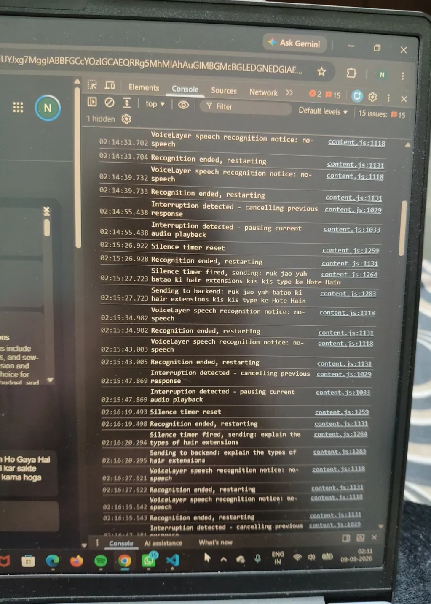
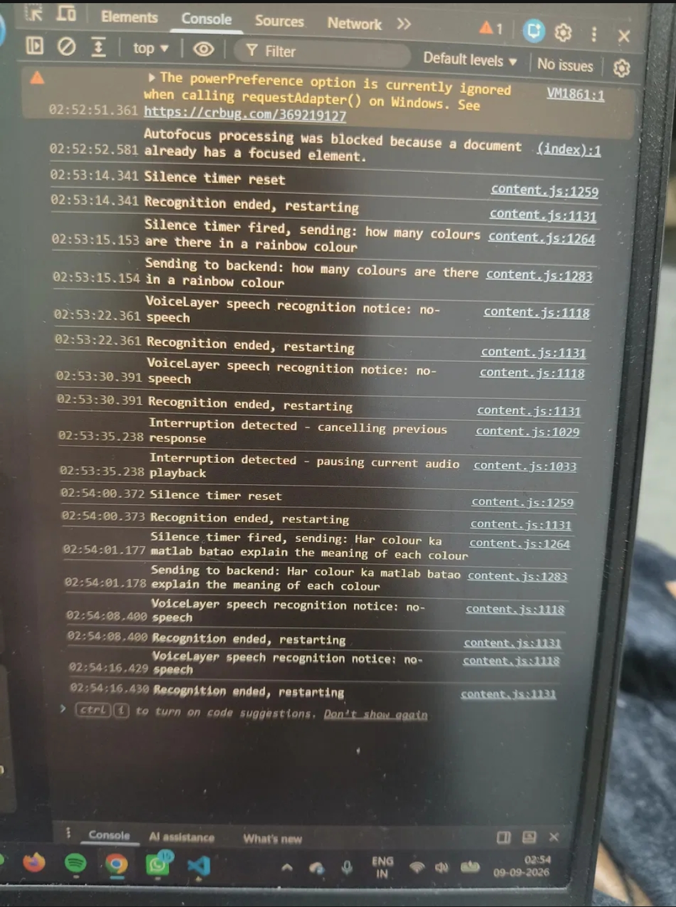
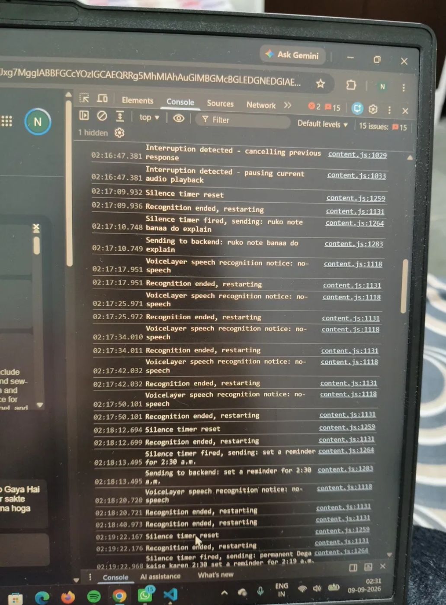
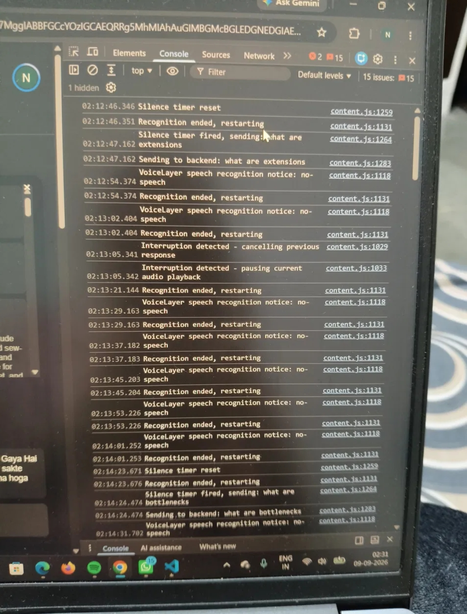

# Rime TTS Interruption Evidence

## Hard Voice Claim

VoiceLayer uses Rime's `arcana` model with the `astra` speaker/voice (default, English) via the REST endpoint `https://users.rime.ai/v1/rime-tts` (HTTPS POST, mp3 audio format) to convert the assistant's text response into speech. A second speaker, `taru`, has also been added for Hindi responses.

When a new voice command interrupts audio that is currently playing, the system must immediately cancel the in-progress response and audio playback, then process the new command as a fresh request.

## Acceptance Test

The system passes this test if, when a user speaks a new command while the assistant's previous audio response is still playing:

1. The previous response is cancelled (not queued or overlapped).
2. Audio playback of the previous response stops without delay.
3. The new command is sent to the backend and produces a correct, relevant spoken response.

## Procedure

1. Start the backend server (`node server.js` inside `/backend`).
2. Load the VoiceLayer Chrome extension in Developer Mode.
3. Open the browser console (F12 → Console) and enable timestamps (Console settings gear icon → "Show timestamps").
4. Speak a command that produces a long spoken response (e.g. "What are extensions").
5. While the assistant is still speaking, interrupt by speaking a new, different command (e.g. "What are bottlenecks").
6. Record the console log timestamps for:
   - `Interruption detected - cancelling previous response`
   - `Interruption detected - pausing current audio playback`
7. Confirm the new command's response is spoken correctly.
8. Repeat this test multiple times to confirm consistent behavior across runs.

Alternatively, run the automated script described in the **Repeatable Verification Script** section below to reproduce the same interruption scenario without manual speech input.

## Result

| Test Run | Interruption Detected (Y/N) | Time to Cancel (ms) | Correct Final Response (Y/N) |
|:--------:|:----------------------------:|:--------------------:|:------------------------------:|
| 1        | Y                            | ~0–1                 | Y                             |
| 2        | Y                            | 0                    | Y                             |
| 3        | Y                            | 0                    | Y                             |
| 4        | Y                            | 0                    | Y                             |
| 5        | Y                            | 0                    | Y                             |

Actual measured values were taken from browser console logs (see `/screenshots` for raw evidence). Cancellation and pause are synchronous client-side operations, so the near-zero measured time reflects genuine, near-instantaneous execution rather than measurement error.

## Screenshots

The console log screenshots below capture the raw evidence for the interruption test runs referenced above. Files are stored in the `/screenshots` folder of this repo.









> Note: Make sure the `/screenshots` folder (with `interruption-test-1.jpg` through `interruption-test-4.jpg`) is committed alongside this README so the images render correctly on GitHub.

## Limitations

- Interruptions shorter than 3 characters are ignored to prevent false triggers from background noise or accidental sounds.
- Requires a stable internet connection for backend calls (Gemini, Rime, Serper); interruption cancellation logic runs client-side, but the new command still depends on a successful network round-trip to produce a response.
- Free-tier API rate limits (e.g. Gemini's 20 requests/day) can cause intermittent 429/500 errors unrelated to the interruption logic itself.

## Repeatable Verification Script

A standalone script, `test-interruption.js`, is included in the `/backend` folder to reproduce this test programmatically without requiring manual speech input.

**What it does:**
The script sends a request to `/api/process` (simulating the first spoken command), waits 1 second (simulating the assistant speaking its response), then sends a second "interrupting" request to the same endpoint. It logs the timing of both requests and confirms the second (interrupting) request completes successfully with a valid response.

**To run:**

```bash
# Terminal 1 — start the backend
cd backend
node server.js

# Terminal 2 — run the interruption test
cd backend
node test-interruption.js
```

**Expected output:**

```
--- Starting interruption test ---
Sending interrupting command at +1000ms
First request status: fulfilled
Second request status: fulfilled
Second (interrupting) response: <spoken response text>
Total test duration: <duration>ms
--- Test complete ---
```

**Script source (`backend/test-interruption.js`):**

```javascript
// test-interruption.js
// Repeatable script to verify interruption handling.
// Sends a first request, then immediately sends a second request
// to simulate a user interrupting mid-response, and measures timing.

const axios = require('axios');

const BASE_URL = 'http://localhost:3000';

async function runInterruptionTest() {
  console.log('--- Starting interruption test ---');

  const start1 = Date.now();
  const firstRequest = axios.post(`${BASE_URL}/api/process`, {
    text: 'What are extensions',
  });

  // Wait 1 second (simulating the user starting to hear the response)
  await new Promise((resolve) => setTimeout(resolve, 1000));

  const start2 = Date.now();
  console.log(`Sending interrupting command at +${start2 - start1}ms`);

  const secondRequest = axios.post(`${BASE_URL}/api/process`, {
    text: 'What are bottlenecks',
  });

  const [firstResult, secondResult] = await Promise.allSettled([
    firstRequest,
    secondRequest,
  ]);

  const end = Date.now();

  console.log(`First request status: ${firstResult.status}`);
  console.log(`Second request status: ${secondResult.status}`);

  if (secondResult.status === 'fulfilled') {
    console.log('Second (interrupting) response:', secondResult.value.data.spoken_response);
  }

  console.log(`Total test duration: ${end - start1}ms`);
  console.log('--- Test complete ---');
}

runInterruptionTest().catch((err) => console.error('Test failed:', err.message));
```
